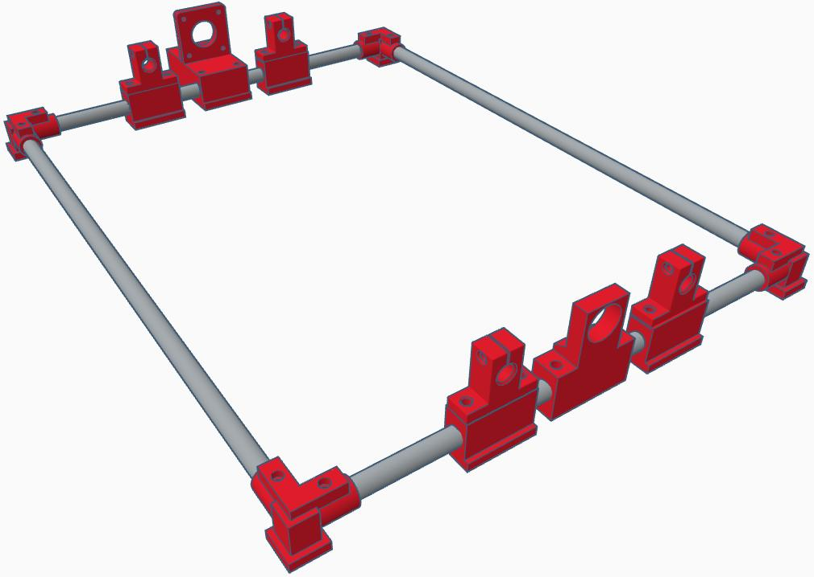
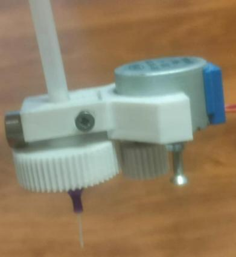
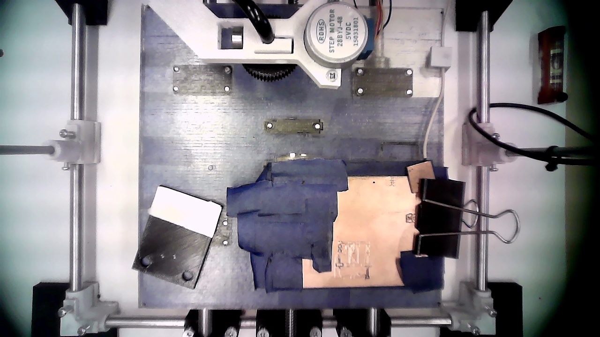
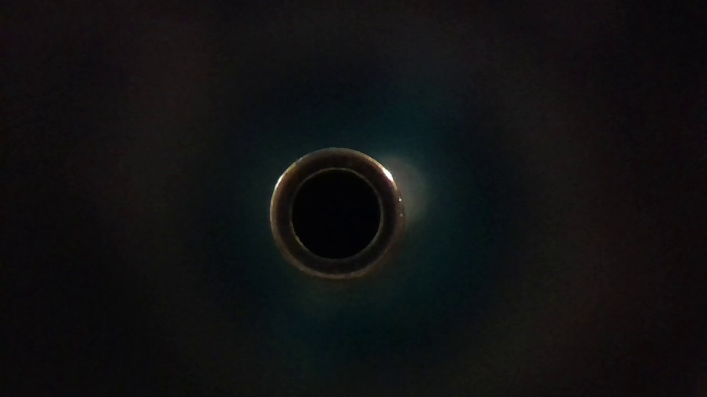
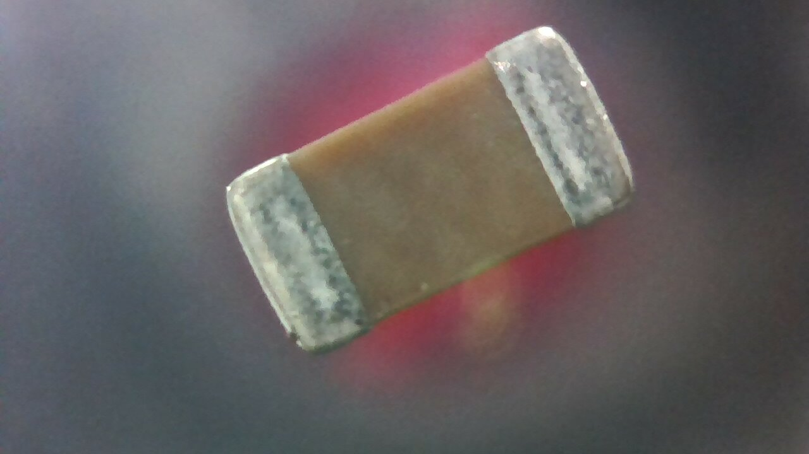

# LPODRO

  

**A cheap, highly automated, and compact machine for home production of PCBs and finished electronic circuits.**

[machine](docs/images/1.jpg)

LPODRO was designed with makers, hobbyists, amateurs, and small workshops in mind. It replaces chemical processes with precise milling of traces and holes, and its pick-and-place module automatically mounts SMD components onto the finished boards. A vision system automates calibration, inspection, and position correction of components. The project is open-source — anyone can build and modify the machine for rapid prototyping of their own circuits.

## Table of Contents

- [What it does](#what-it-does)

- [Current project status](#current-project-status)

- [Requirements](#requirements)

- [Repository structure](#repository-structure)

- [Getting started](#getting-started)

- [Machine construction](#machine-construction)

- [PnP head](#pnp-head)

- [Vision system](#vision-system)

- [Control electronics](#control-electronics)

- [Software](#software)

- [Automated circuit soldering (planned)](#automated-circuit-soldering-planned)

- [Roadmap / TODO](#roadmap--todo)

- [License](#license)

## What it does

At the core of LPODRO is a machine surrounded with a simple, automated workflow: the user supplies laminate and SMD components, and the machine carries out the successive stages of the process. The cameras determine the positions of the supplied materials and monitor every stage of production. A spindle precisely mills traces and mounting holes, eliminating the need for outdated and hazardous chemical PCB production processes and turning raw laminate into a functional PCB. The pick-and-place module then places the SMD components onto the board with high accuracy, and an integrated soldering module (to be added) will permanently bond the components to the board — so that with minimal effort and without needing extensive knowledge, the user ends up with a fully finished, working circuit.

## Current project status

> **The project is still a work in progress (WIP).**

At this point, LPODRO can reliably:

- mill single-layer PCBs,

- detect 0805 and bigger components,

- use them for automated assembly.

The 3D models, software, and other materials presented in this repository are not yet finished or fully polished. Proper documentation and many features are missing, there are known bugs and issues, and more are yet to be found.

At this point I'm not discouraging anyone to build LPODRO for yourself. Most of the features I plan to add will be done either through software or by adding stuff ontop of existing hardware. Even now LPODRO can be useful but with time it will be easier to build and have more functions. Note that right know you need some knowledge to work with LPODRO (look at [Requirements](#requirements))

## Requirements

Before starting a build, it helps to have:

- Basic knowledge of how CNC machines are built and operated — both mechanically and on the software side, later on this requirement will be removed through easier to use software.

- Basic knowledge and tools needed to solder, program MCUs and assemble hardware (cutting, grinding etc.).

## Repository structure

```
LPODRO/      
├── hardware/   STEP/STL files, schematics and technical drawings  
├── software/   Python script for the raspberry pi and main code alongside requirements.txt      
├── docs/       Assembly instructions, user manual and photos      
├── LICENSE      
└── README.md
```

## Getting started

Everything you need to get started is in the [assembly manual](docs/manuals/assembly%20manual.odt).

## Machine construction

The mechanical construction of LPODRO is based on a frame made of steel rods joined with 3D-printed angle brackets. This solution allows for a simple and extremely cheap frame, which forms the basis of the entire machine — subsequent parts, such as motor mounts and axis holders, slide onto it. The drive system for the X, Y, and Z (spindle) axes is based on the classic mechanism of two guide rails and one T8 trapezoidal lead screw driven by a Nema17 stepper motor. The machine is equipped with two Z axes: the first moves the spindle, and the second — mounted on the spindle holder — operates the PnP head, allowing independent control of the spindle and the head and simplifying the mechanics.



## PnP head

The PnP head was built from scratch for this project, using widely available and very cheap parts while retaining the functionality of commercially available equivalents. It features an easy needle-change mechanism, with needles widely available in a variety of sizes. It also has a built-in stepper motor that, working together with the vision system, rotates the picked-up components appropriately so that they land in the correct position on the PCB being produced. The head's motion system uses a non-standard, simple drive based on a wound string: the motor winds or unwinds the string, changing its effective length, which translates into the up-down movement of the head. This solution ensures low cost, simple construction, and high resistance to mechanical damage — in the event of a collision, the head will simply "bottom out" against the work surface instead of being damaged.



You can also check out the [demo](https://youtu.be/qNj2u1QFK_k).

## Vision system

A key element of the system is two cameras. A ceiling camera, positioned above the work surface, photographs the entire working area to locate the laminate, automatically determine the optimal zero point (minimizing material waste), and detect the positions of SMD components prepared by the user for mounting. A second camera is mounted flush with the work surface — the picked-up SMD component passes over the lens, and the vision system determines its orientation and offset relative to the PnP needle, allowing precise correction of rotation and position before placement. This is conceptually identical to industrial PnP equipment, but implemented in a cost-effective way.

  

## [Control electronics](hardware/schematics/Schematic.pdf).

The control electronics are based on widely available components: an Arduino Nano running GRBL firmware controls the X, Y, and Z axes using A4988 stepper drivers. A second system, a Raspberry Pi Zero W, currently controls the PnP head's stepper motors as well as the operation of the spindle, vacuum pump and LEDs. All other processes (G-code generation, auto-leveling, sending information to the machine, receiving the camera signal, etc.) currently run on a computer that must remain constantly connected to the machine. In the future, the Raspberry Pi will take over all these tasks, meaning that operating the machine will only require any device from which a PCB Gerber file and a PnP coordinate file can be sent — similar to modern 3D printers. To achieve this, the plan also includes adding a screen and buttons to the machine.

## Software

The software for LPODRO was written from scratch because available solutions (both commercial and open source) did not fully meet the required automation and usability goals. It's responsible for fully automating the process: auto-calibration, image analysis, milling toolpath generation, pick-and-place operation sequencing, position correction using camera data, and error handling and safety procedures. Currently, the user interface is CLI-based; a GUI overlay is planned for the future to significantly improve ease of use. Currently, the software supports importing popular PCB design formats, process parameterization, and job progress monitoring. All of the software is written in Python.

## Automated circuit soldering (planned)

The project plans to add an integrated heating plate to the machine, placed in the work surface. Once a board with solder paste applied is placed on it, the system will adjust the temperature profile and evenly heat the PCB to reflow temperature, enabling mass, repeatable bonding of SMD components without manual soldering of individual parts. This will significantly raise the level of automation and ergonomics, shortening operation time and reducing user interventions, and will allow the entire process of producing an electronic circuit — creating the PCB, placing components, and soldering them — to be closed within one device. Control of the heating profile (temperature sensor plus regulation) will ensure assembly safety and repeatable results across different boards and components.

## Roadmap / TODO

**Hardware**

- [ ] 

- Improve the general experience with SMD components

- [ ] 

- Add automated circuit soldering

- [ ] 

- Add a way to make two-layer PCBs

- [ ] 

- Try converting an old 3D printer into LPODRO

**Software**

- [ ] 

- Add a way to generate stencil files (to either 3d print or mill)

- [ ] 

- Move everything that runs on an addtional PC to the RPI

- [ ] 

- Add a GUI to the software

**Documentation**

- [ ] Improve the manual

## License

This project is released under the [MIT License](LICENSE).

